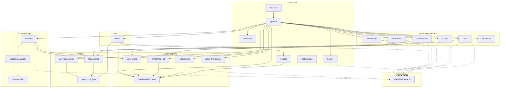

# C4 — Componentes (Nível 3)

> Architect · 2026-09-10 · Nature Residencial Landing  
> Foco: container **Nature SPA**  
> Confiança: 🟢 estrutura de módulos confirmada em code-analysis / modules.json

---

## Diagrama

---

## Componentes por módulo

### app-shell 🟢
| Componente | Responsabilidade |
|------------|------------------|
| `main.tsx` | Mount React + plugins GSAP |
| `App.tsx` | Orquestra seções, `ready`/`introVisible`, provider |
| `Preloader` | Intro de marca com timeouts e escape |
| `Header` | Nav sticky + histerese + menu mobile |
| `Footer` | Contatos institucionais + wa.me |
| `NatureLogo` | Marca tipográfica/SVG |

### hero 🟢
| Componente | Responsabilidade |
|------------|------------------|
| `Hero` | Full-bleed, headline SplitText, CTA lead, facts |

### marketing-sections 🟢
| Componente | Responsabilidade |
|------------|------------------|
| `LifeMoment` | Essência / momento de vida |
| `Pillars` | Diferenciais |
| `FloorPlans` | Seletor por metragem + `nature:plan` |
| `Amenities` | Rail horizontal de lazer |
| `Architecture` | Galeria + tags |
| `Trust` | Selos institucionais |

### location-map 🟢
| Componente | Responsabilidade |
|------------|------------------|
| `Location` | Layout da seção |
| `LocationMapLazy` | Code-split por IntersectionObserver |
| `LocationMap` | Leaflet, POIs, gate de interação |

### lead-capture 🟢
| Componente | Responsabilidade |
|------------|------------------|
| `LeadModalContext` | Estado global open/close |
| `LeadModal` | Dialog + validação + submit local |
| `SectionCta` | CTA padrão → modal |
| `WhatsAppFab` | FAB + bubble agendado |
| `LeadForm` | Seção `#contato` (painel CTA) |

### motion 🟢
| Componente | Responsabilidade |
|------------|------------------|
| `gsap.ts` / `lib/gsap.ts` | Registro e CustomEase |
| `usePageMotion` | Reveals/scroll da página |
| `RevealText` | Texto com reveal |

### content-data 🟢
| Componente | Responsabilidade |
|------------|------------------|
| `siteData` | Copy e URLs comerciais no bundle |

---

## Dependências entre módulos

| Módulo | Depende de |
|--------|------------|
| app-shell | lead-capture, hero, content-data, motion |
| hero | lead-capture, motion |
| marketing-sections | content-data, lead-capture, motion |
| location-map | content-data, lead-capture, motion |
| lead-capture | motion |
| motion | — |
| content-data | — |
