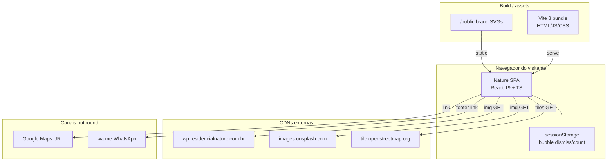

# C4 — Containers (Nível 2)

> Architect · 2026-09-10 · Nature Residencial Landing  
> Confiança: 🟢 stack e limites confirmados; deploy/hosting 🟡 não versionado neste repo

---

## Diagrama

---

## Containers

| Container | Tecnologia | Responsabilidade | Confiança |
|-----------|------------|------------------|-----------|
| **Nature SPA** | React 19, React DOM, TypeScript | UI, validação lead, motion GSAP, mapa Leaflet | 🟢 |
| **Vite bundle** | Vite 8 + Tailwind 4 | Empacota e serve assets | 🟢 |
| **public/** | arquivos estáticos | Brand SVG (`nature-symbol.svg` etc.) | 🟢 |
| **sessionStorage** | Web Storage API | Estado de sessão do WhatsAppFab/bubble | 🟢 |
| **CDN WP Nature** | HTTPS images | Mídia comercial oficial | 🟢 |
| **Unsplash** | HTTPS images | Galeria Architecture | 🟢 |
| **OSM tiles** | HTTPS raster | Fundo do mapa | 🟢 |
| **Google Maps / WhatsApp** | links HTTPS | Saída do site | 🟢 |

## Comunicação

| De | Para | Como | Confiança |
|----|------|------|-----------|
| SPA | CDN WP / Unsplash | `` / CSS background | 🟢 |
| SPA | OSM | Leaflet `TileLayer` | 🟢 |
| SPA | sessionStorage | getItem/setItem chaves `nature_bubble_*` | 🟢 |
| SPA | CRM | — | 🔴 inexistente |
| SPA | Backend próprio | — | 🟢 ausente por design |

## Observações

- Não há container de API, banco, fila ou cache server-side. 🟢
- Hosting (Figma Make / estático) não está definido por Dockerfile/compose neste repo. 🟡
