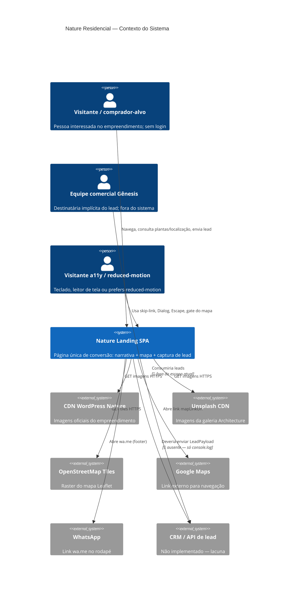
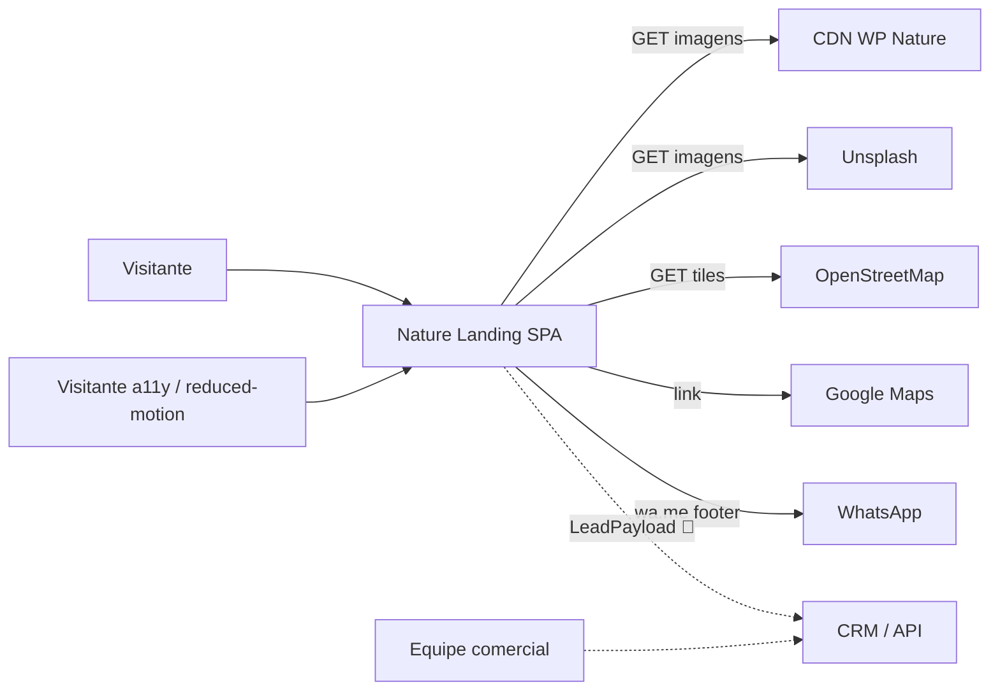

# C4 — Contexto (Nível 1)

> Architect · 2026-09-10 · Nature Residencial Landing  
> Confiança: relações 🟢 CONFIRMADO no código; destino do lead 🔴 LACUNA

---

## Diagrama

> Nota: se o renderer não suportar C4, use o diagrama de fluxo abaixo.

---

## Atores

| Ator | Relação com o sistema | Confiança |
|------|----------------------|-----------|
| Visitante / comprador-alvo | Único usuário runtime; scroll + CTAs + formulário | 🟢 |
| Equipe comercial Gênesis | Destinatária implícita; sem UI no sistema | 🟢 / 🔴 |
| Visitante a11y / reduced-motion | Mesma SPA com caminhos abreviados | 🟢 |

---

## Sistemas externos

| Sistema | Tipo | Confiança |
|---------|------|-----------|
| CDN WordPress (`wp.residencialnature.com.br`) | Mídia inbound | 🟢 |
| Unsplash | Mídia inbound (galeria arquitetura) | 🟢 |
| OpenStreetMap tile server | Mapa inbound | 🟢 |
| Google Maps (URL) | Navegação outbound | 🟢 |
| WhatsApp (`wa.me`) | Contato outbound (footer) | 🟢 |
| CRM / endpoint de lead | **Inexistente** | 🔴 |

---

## Limite do sistema

Dentro: React SPA + assets estáticos + `sessionStorage` do bubble.  
Fora: CMS WordPress institucional, CRM, autenticação, painel admin, estoque de unidades.
