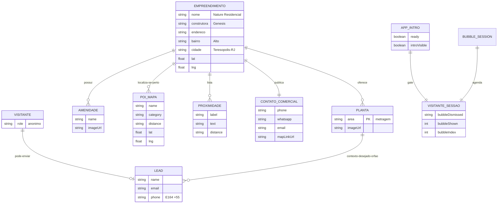

# ERD Completo — Nature Residencial Landing

> Architect · 2026-09-10  
> Não há banco relacional. Este ERD modela **entidades de domínio em memória / bundle** e relações lógicas.  
> Confiança: atributos 🟢 CONFIRMADO; FKs 🟡 conceituais (sem persistência)

---

## Diagrama

---

## Entidades

| Entidade | Origem no código | PK lógica | Persistência | Confiança |
|----------|------------------|-----------|--------------|-----------|
| Empreendimento | implícito + `siteData` / LocationMap | — | bundle | 🟢 |
| Planta (`FloorPlanOption`) | `siteData.floorPlans.plans` | `area` | bundle | 🟢 |
| Amenidade (rail) | constante em `Amenities.tsx` | `name` | bundle | 🟢 |
| Proximidade | `siteData.location.proximity` | `label` | bundle | 🟢 |
| POI mapa | `points[]` em `LocationMap.tsx` | `name`+`position` | bundle | 🟢 |
| Contato comercial | `siteData.contact` / footer | — | bundle | 🟢 |
| Lead (`LeadPayload`) | `LeadModal` | — | **nenhuma** (console.log) | 🟢 / 🔴 |
| AppIntroState | `App.tsx` | — | React state | 🟢 |
| Bubble session | `WhatsAppFab` | chaves storage | sessionStorage | 🟢 |

---

## Relacionamentos

| De | Para | Cardinalidade | Notas | Confiança |
|----|------|---------------|-------|-----------|
| Empreendimento | Planta | 1:N | 4 metragens | 🟢 |
| Empreendimento | Amenidade | 1:N | 11 espaços no rail | 🟢 |
| Empreendimento | POI / Proximidade | 1:N | fontes **paralelas** (duplicação) | 🟡 |
| Visitante | Lead | 0..1 por interação | sem conta | 🟢 |
| Planta → Lead | 1:0..N desejado | via `nature:plan` **sem consumidor** | 🔴 |
| Visitante sessão | Bubble | 1:1 | max 3 shows / dismiss | 🟢 |

---

## Lacunas de modelo

1. 🔴 Sem tabela/coleção de leads em servidor.  
2. 🟡 Amenities categorias (`siteData`) ≠ rail visual.  
3. 🟡 `mapEmbedUrl` sem entidade consumidora.  
4. 🟢 Sem usuários autenticados / RBAC persistido.
