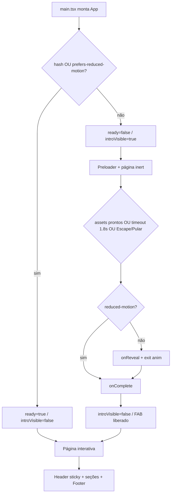

# Fluxograma — app-shell

```mermaid
flowchart TD
  A[main.tsx monta App] --> B{hash OU prefers-reduced-motion?}
  B -->|sim| C[ready=true / introVisible=false]
  B -->|não| D[ready=false / introVisible=true]
  D --> E[Preloader + página inert]
  E --> F{assets prontos OU timeout 1.8s OU Escape/Pular}
  F --> G{reduced-motion?}
  G -->|sim| H[onComplete]
  G -->|não| I[onReveal + exit anim]
  I --> H
  H --> J[introVisible=false / FAB liberado]
  C --> K[Página interativa]
  J --> K
  K --> L[Header sticky + seções + Footer]
```

Confiança: 🟢 CONFIRMADO
