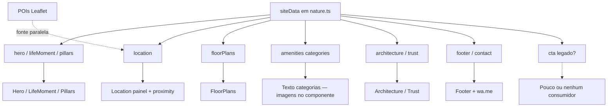

# Fluxograma — content-data

```mermaid
flowchart TD
  A[siteData em nature.ts] --> B[hero / lifeMoment / pillars]
  A --> C[location]
  A --> D[floorPlans]
  A --> E[amenities categories]
  A --> F[architecture / trust]
  A --> G[footer / contact]
  A --> H[cta legado?]

  B --> I[Hero / LifeMoment / Pillars]
  C --> J[Location painel + proximity]
  D --> K[FloorPlans]
  E --> L[Texto categorias — imagens no componente]
  F --> M[Architecture / Trust]
  G --> N[Footer + wa.me]
  H -.-> O[Pouco ou nenhum consumidor]

  P[POIs Leaflet] -.->|fonte paralela| C
```

Confiança: 🟢 CONFIRMADO · `cta` e `mapEmbedUrl` 🟡 INFERIDO como legado
