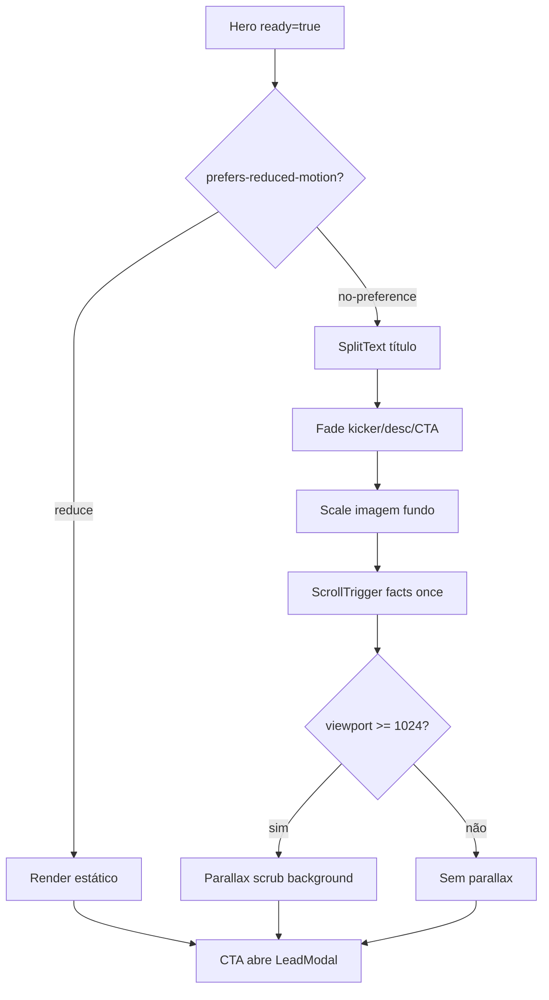

# Fluxograma — hero

```mermaid
flowchart TD
  A[Hero ready=true] --> B{prefers-reduced-motion?}
  B -->|reduce| C[Render estático]
  B -->|no-preference| D[SplitText título]
  D --> E[Fade kicker/desc/CTA]
  E --> F[Scale imagem fundo]
  F --> G[ScrollTrigger facts once]
  G --> H{viewport >= 1024?}
  H -->|sim| I[Parallax scrub background]
  H -->|não| J[Sem parallax]
  C --> K[CTA abre LeadModal]
  I --> K
  J --> K
```

Confiança: 🟢 CONFIRMADO
