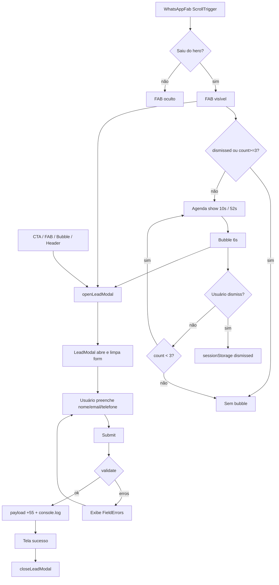

# Fluxograma — lead-capture

```mermaid
flowchart TD
  A[CTA / FAB / Bubble / Header] --> B[openLeadModal]
  B --> C[LeadModal abre e limpa form]
  C --> D[Usuário preenche nome/email/telefone]
  D --> E[Submit]
  E --> F{validate}
  F -->|erros| G[Exibe FieldErrors]
  G --> D
  F -->|ok| H["payload +55 + console.log"]
  H --> I[Tela sucesso]
  I --> J[closeLeadModal]

  K[WhatsAppFab ScrollTrigger] --> L{Saiu do hero?}
  L -->|sim| M[FAB visível]
  L -->|não| N[FAB oculto]
  M --> O{dismissed ou count>=3?}
  O -->|sim| P[Sem bubble]
  O -->|não| Q[Agenda show 10s / 52s]
  Q --> R[Bubble 6s]
  R --> S{Usuário dismiss?}
  S -->|sim| T[sessionStorage dismissed]
  S -->|não| U{count < 3?}
  U -->|sim| Q
  U -->|não| P
  R --> B
  M --> B
```

Confiança: 🟢 CONFIRMADO · persistência de lead 🔴 LACUNA
