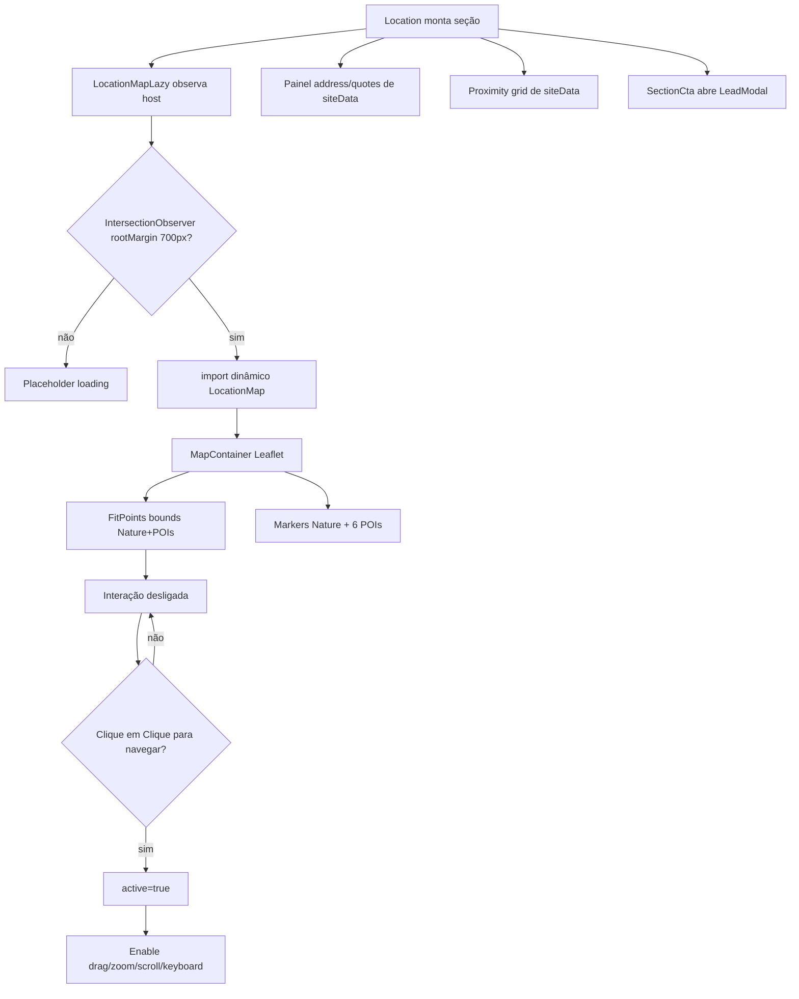

# Fluxograma — location-map

```mermaid
flowchart TD
  A[Location monta seção] --> B[LocationMapLazy observa host]
  B --> C{IntersectionObserver rootMargin 700px?}
  C -->|não| D[Placeholder loading]
  C -->|sim| E[import dinâmico LocationMap]
  E --> F[MapContainer Leaflet]
  F --> G[FitPoints bounds Nature+POIs]
  G --> H[Interação desligada]
  H --> I{Clique em Clique para navegar?}
  I -->|não| H
  I -->|sim| J[active=true]
  J --> K[Enable drag/zoom/scroll/keyboard]
  F --> L[Markers Nature + 6 POIs]
  A --> M[Painel address/quotes de siteData]
  A --> N[Proximity grid de siteData]
  A --> O[SectionCta abre LeadModal]
```

Confiança: 🟢 CONFIRMADO
