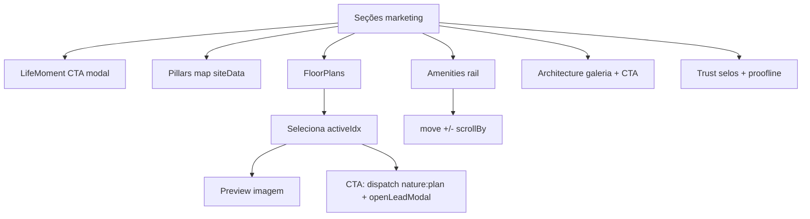

# Fluxograma — marketing-sections

```mermaid
flowchart TD
  A[Seções marketing] --> B[LifeMoment CTA modal]
  A --> C[Pillars map siteData]
  A --> D[FloorPlans]
  D --> E[Seleciona activeIdx]
  E --> F[Preview imagem]
  E --> G[CTA: dispatch nature:plan + openLeadModal]
  A --> H[Amenities rail]
  H --> I[move +/- scrollBy]
  A --> J[Architecture galeria + CTA]
  A --> K[Trust selos + proofline]
```

Confiança: 🟢 CONFIRMADO (UI) · 🟡 evento `nature:plan` sem consumidor
