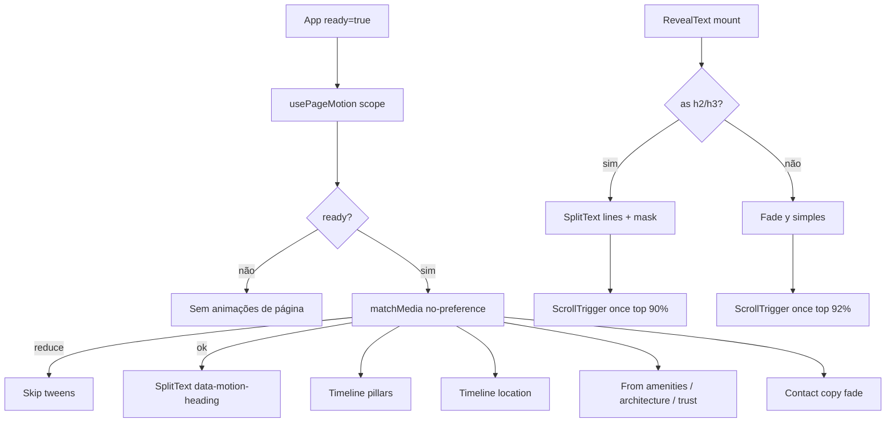

# Fluxograma — motion

```mermaid
flowchart TD
  A[App ready=true] --> B[usePageMotion scope]
  B --> C{ready?}
  C -->|não| D[Sem animações de página]
  C -->|sim| E[matchMedia no-preference]
  E -->|reduce| F[Skip tweens]
  E -->|ok| G[SplitText data-motion-heading]
  E --> H[Timeline pillars]
  E --> I[Timeline location]
  E --> J[From amenities / architecture / trust]
  E --> K[Contact copy fade]

  L[RevealText mount] --> M{as h2/h3?}
  M -->|sim| N[SplitText lines + mask]
  M -->|não| O[Fade y simples]
  N --> P[ScrollTrigger once top 90%]
  O --> Q[ScrollTrigger once top 92%]
```

Confiança: 🟢 CONFIRMADO
