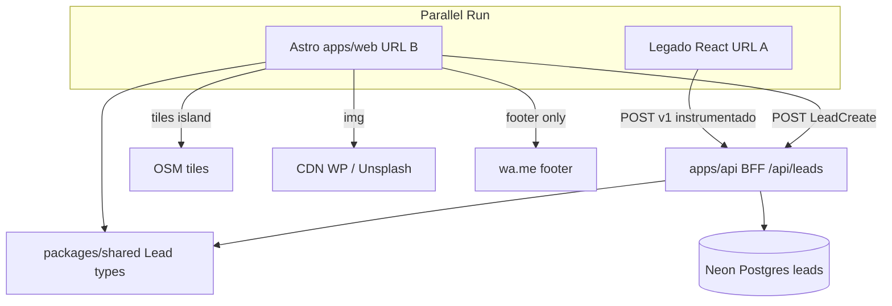

# Target Architecture

> Sistema novo: Astro + BFF + Neon + packages/shared. Estratégia B (Parallel Run). Topologia híbrida aprovada.

## Visão geral
Landing Nature em **Astro** (HTML estático + islands), estado cross-island via **nanostores**, contrato Lead em **packages/shared** (obrigatório), API **Express/BFF** no mesmo deploy escrevendo em **Neon**. O legado React permanece online em URL paralela durante o parallel run, idealmente também POSTANDO no Neon com `pagina_origem` distinta.

## Diagrama

## Componentes

| Componente | Tipo | Responsabilidade |
|---|---|---|
| apps/web | App (Astro) | Landing, islands, content |
| features/shell | UI | Preloader/ready, header, footer |
| features/lead | UI island | Modal, FAB, CTAs → nanostores |
| features/location | UI island | Leaflet lazy + gate |
| features/marketing|hero|motion | UI | Seções / motion gated |
| src/data | Content | siteData único (POIs + amenities) |
| packages/shared | Lib | Tipos Lead + allowlist PATCH |
| apps/api | API | POST /api/leads; PATCH fase 2 |
| Neon | DB | Tabela leads compartilhada |
| Legado React | App paralelo | URL A; instrumentar POST |

## Bounded contexts
1. **Content** — siteData, copy, mídia, POIs, amenities  
2. **Experience Shell** — ready/intro, header, footer, motion gate  
3. **Conversion** — lead UI + BFF + Neon  
4. **Location** — mapa/proximidade  
5. **Shared Contracts** — pacote (não BC de negócio; anti-drift)

## Decisões arquiteturais
| ID | Decisão | Origem |
|----|---------|--------|
| AD-T01 | Topologia híbrida + packages/shared obrigatório | topology_decision |
| AD-T02 | BFF mesmo deploy | HUMANA-003=c |
| AD-T03 | Parallel Run duas URLs → mesmo Neon | strategy B |
| AD-T04 | v1 POST-only; PATCH fase 2 | HUMANA-001/002 |
| AD-T05 | nanostores no lugar de Context | paradigm + discard |
| AD-T06 | GSAP/Leaflet/Tailwind mantidos | brief |
| AD-T07 | pagina_origem diferencia frentes | OpenAPI / Neon |

## Honra ao paradigma escolhido (híbrido / balanced)
| Implicação paradigm_decision | Materialização |
|---|---|
| Context não atravessa islands | nanostores em Conversion/Shell |
| App root único descartado | pages Astro + features |
| Lead vira cliente de API | apps/api + shared types |
| Conteúdo fonte única | src/data; shared para Lead |

## Honra à topologia escolhida (híbrido opção 3)
Árvore final conforme `topology_decision.md` (marketing/hero/location preservados; shell/lead/api/shared/data modernos). **Proibido** tipar Lead fora de `packages/shared`.

## Notas Parallel Run
- Comparação justa exige legado gravando no Neon (R13).
- SEO/ads ainda provisório até confirmação do time.

## Emenda dados (2026-09-10)
- Neon: **mesma tabela** do sync CVCRM; **proibido criar tabela paralela**. Schema definitivo 🔴 até admin Neon. Ver `target_data_model.md`.
