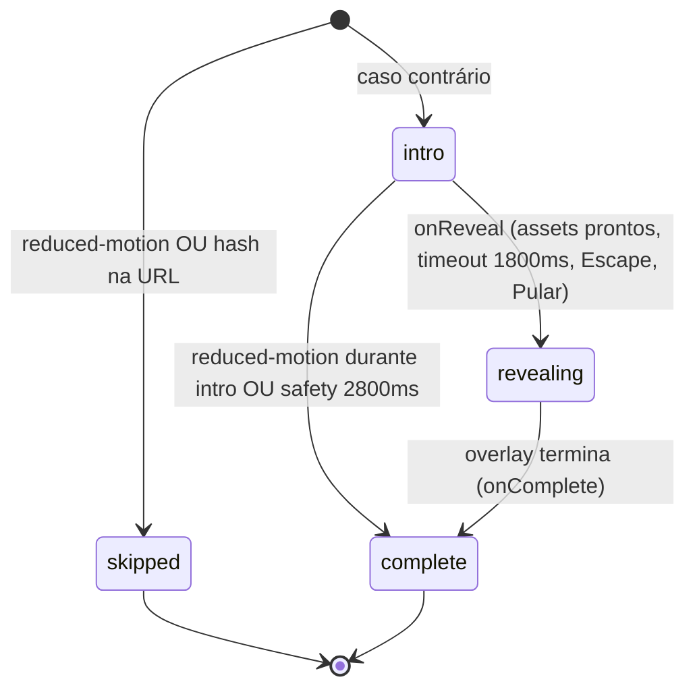
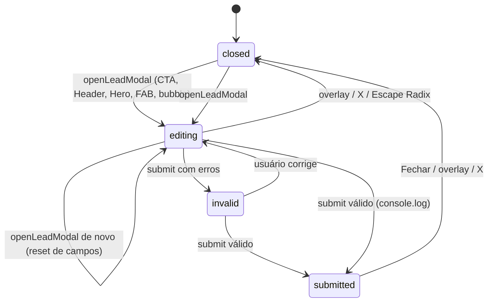
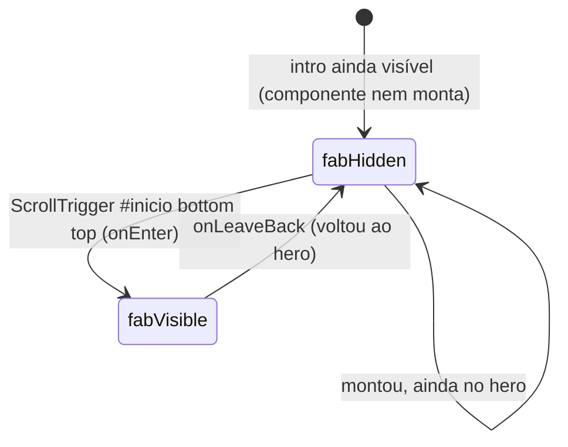
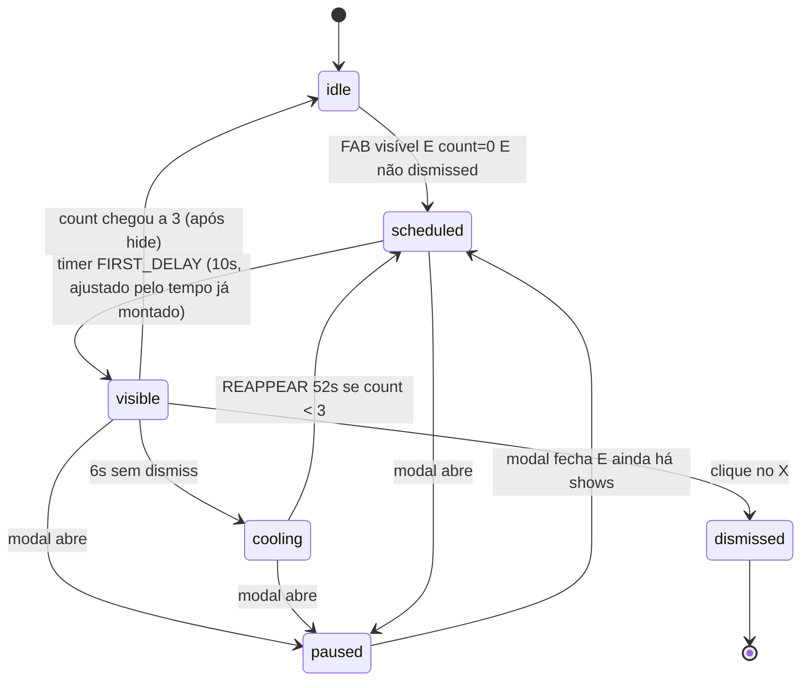
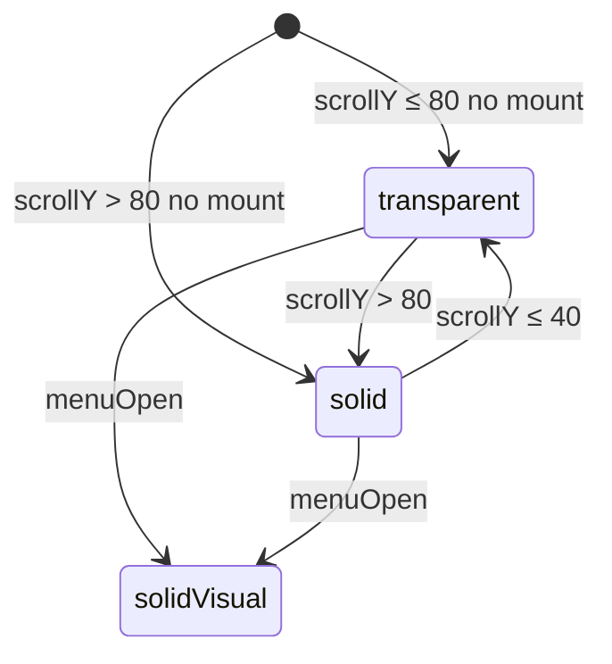
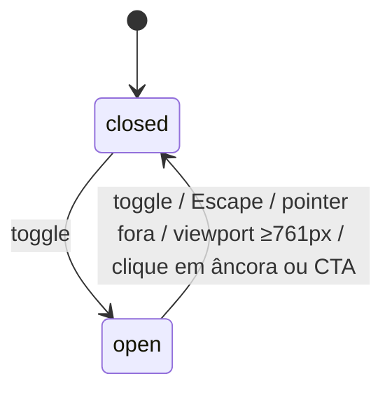
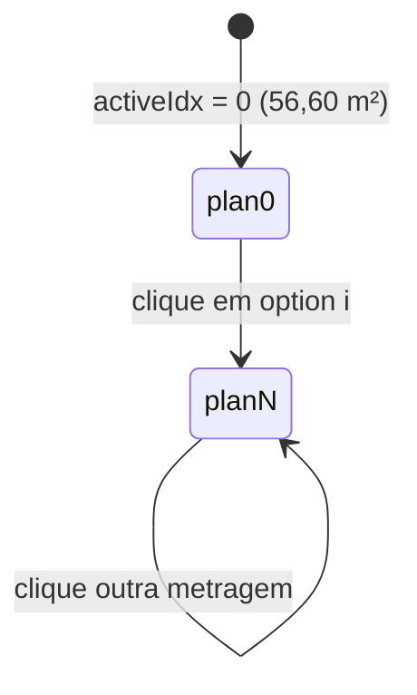
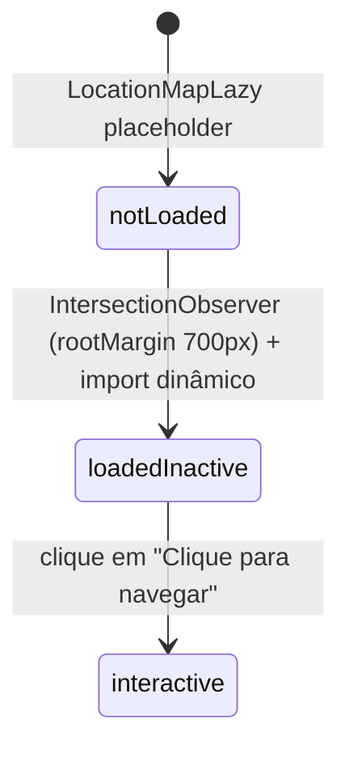

# Máquinas de estado — Nature Residencial

> Detective · 2026-09-10  
> `doc_level`: completo  
> Não há entidades persistidas com `status` em banco. Os estados abaixo são **UI/sessão no cliente**. 🟢

---

## 1. Intro da página (`ready` + `introVisible`)

Estados efetivos derivados de `App.tsx` + `Preloader.tsx`.

| Estado | Condição | Confiança |
|--------|----------|-----------|
| `skipped` | `ready=true`, `introVisible=false` no mount (reduced-motion **ou** `location.hash`) | 🟢 |
| `intro` | `ready=false`, `introVisible=true` — overlay visível, página `inert` | 🟢 |
| `revealing` | `onReveal()` → `ready=true`, overlay ainda visível (slide `yPercent: -100`) | 🟢 |
| `complete` | `onComplete()` → `ready=true`, `introVisible=false` — FAB pode montar | 🟢 |

### Transições

### Gatilhos 🟢

| De | Para | Gatilho |
|----|------|---------|
| mount | `skipped` | `prefers-reduced-motion: reduce` **ou** `window.location.hash` |
| `intro` | `revealing` | `Promise.all(image.decode, fonts.ready, entry tween)` **ou** timeout 1800ms **ou** Escape **ou** “Pular introdução” |
| `intro` | `complete` | `reduce.matches` no `exit` **ou** safety timeout 2800ms (`finish` direto) |
| `revealing` | `complete` | tween de saída `onComplete` |

Não há retorno de `complete` para `intro` na mesma sessão. 🟢

---

## 2. Lead modal (`isOpen` + campos + `submitted`)

Máquina composta: o context só conhece aberto/fechado; o formulário adiciona validação e sucesso.

### Regras de transição 🟢

| Gatilho | Efeito |
|--------|--------|
| `openLeadModal` | `isOpen=true`; effect zera `name`, `email`, `phone`, `errors`, `submitted` |
| submit inválido | permanece aberto; `FieldErrors` por campo |
| submit válido | payload `{name, email, phone:"+55…"}` → `console.log` → `submitted=true` |
| `closeLeadModal` / `onOpenChange(false)` | `isOpen=false` |

**Lacuna 🔴:** não há estado `sending` / `error` de rede — o sucesso não depende de ACK.

---

## 3. FAB + bubble (`WhatsAppFab`)

Estados simultâneos: visibilidade do FAB (scroll) e ciclo da bubble (timers + sessionStorage).

### 3.1 FAB (scroll)

O componente só monta quando `!introVisible`. 🟢

### 3.2 Bubble

### Persistência de sessão 🟢

| Chave | Semântica |
|-------|----------|
| `nature_bubble_dismissed=1` | estado terminal `dismissed` até fechar a aba |
| `nature_bubble_shown` | contador; teto 3 |
| `nature_bubble_index` | índice rotativo em `PHRASES` |

Clique no FAB ou no corpo da bubble **não** altera dismissed; abre o modal (`openLeadModal`). 🟢

---

## 4. Header sólido / menu

### 4.1 Superfície do header

`data-scrolled={isSolid \|\| menuOpen}` — menu aberto força o visual sólido mesmo no topo. 🟢

Histerese 80/40 é regra anti-flicker, não requisito de negócio imobiliário. 🟢 técnico

### 4.2 Menu mobile

---

## 5. Seletor de plantas

Não há persistência da escolha. O CTA dispara `nature:plan` com `plan.area` e abre o modal; o modal **não** guarda a metragem. 🔴

---

## 6. Mapa Leaflet

Não há transição de volta para inativo. 🟢

---

## 7. Entidades sem máquina de status

Não existem: pedido, unidade (estoque), usuário autenticado, contrato, pagamento.

O disclaimer do footer deixa implícito que **disponibilidade é estado externo** (equipe comercial), não modelado aqui. 🔴
